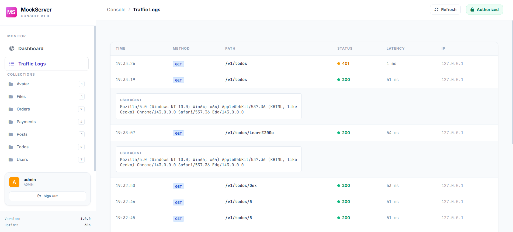
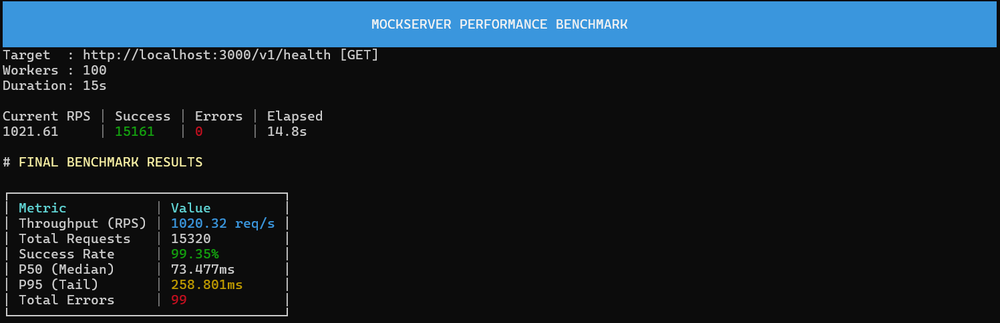

# 

[](https://github.com/onurartan/mockserver)
[](https://github.com/onurartan/mockserver)
[](https://opensource.org/licenses/MIT)
[](https://golang.org/)

---

## Table of Contents

- [Overview](#overview)
- [Architecture](#architecture)
- [Installation](#installation)
- [Quick Start](#quick-start)
- [Configuration](#configuration)
- [Advanced Features](#advanced-features)
- [API Reference](#api-reference)
- [Development](#development)
- [Performance](#performance)
- [Contributing](#contributing)
- [License](#license)

---

## Overview

**MockServer** is a high-performance mock API server built with Go. It enables developers to create sophisticated API simulations using declarative JSON/YAML configurations, supporting complex routing, authentication, state management, and real-time request proxying.

### Key Capabilities

- **Declarative Configuration**: JSON/YAML-based route definitions with JSON Schema validation
> **📘 Detailed Schema Guide**: For a deep dive into all available configuration options, validation rules, and JSON Schema definitions, please refer to the [MockServer Schema Documentation](https://github.com/onurartan/mockserver/blob/main/.docs/mockserver-schema.md).
- **Hybrid Routing**: Mock static responses or proxy to real APIs with intelligent request transformation
- **Advanced Authentication**: Multi-method auth (API Key, Bearer Token) with route-level overrides
- **State Management**: In-memory state engine for stateful API simulations
- **Request Processing**: Template engine with conditional logic and dynamic response generation
- **Real-time Monitoring**: Built-in console UI and debug endpoints for request inspection
- **Hot Reloading**: Automatic configuration reload without server restart
- **Cross-platform**: Native binaries for Linux, macOS, and Windows

---

## Architecture

MockServer follows a modular architecture designed for extensibility and performance:

```
┌─────────────────┐    ┌──────────────────┐    ┌─────────────────┐
│   Config Layer  │────│  Routing Engine  │────│  Handler Layer  │
│  (JSON/YAML)    │    │                  │    │ (Mock/Fetch)    │
└─────────────────┘    └──────────────────┘    └─────────────────┘
         │                       │                       │
         │              ┌────────────────┐               │
         └──────────────│ State Engine   │───────────────┘
                        │ (In-memory)    │
                        └────────────────┘
```

### Core Components

- **Config System**: Validates and loads configurations with schema enforcement
- **Routing Engine**: High-performance HTTP router with middleware pipeline
- **Handler Layer**: Processes requests through mock or fetch strategies
- **State Engine**: Manages stateful interactions and conditional logic
- **Template Processor**: Dynamic response generation with variable substitution

---

## Installation

### NPM (Recommended)

```bash
npm install -g mockserverx
mockserver start --config mockserver.json
```

### Go Install

```bash
go install github.com/onurartan/mockserver@latest
```

### Binary Download

Download platform-specific binaries from [releases](https://github.com/onurartan/mockserver/releases):

```bash
# Linux/macOS
curl -L https://github.com/onurartan/mockserver/releases/latest/download/mockserver-linux -o mockserver
chmod +x mockserver

# Windows
curl -L https://github.com/onurartan/mockserver/releases/latest/download/mockserver.exe -o mockserver.exe
```

### Docker

You can pull the official image from GitHub Container Registry:

```bash
docker pull ghcr.io/onurartan/mockserver:latest

```

To run MockServer with your local configuration:

```bash
docker run -p 3000:3000 -v $(pwd)/example:/example ghcr.io/onurartan/mockserver:latest

```

> **Note:** Ensure your configuration file is named `mockserver.json` or `mockserver.yaml` inside the mounted `/example` directory.

---

## Quick Start

### 1. Create Configuration

Create `mockserver.json`:

```json
{
  "$schema": "https://opensource.trymagic.xyz/schemas/mockserver.schema.json",
  "server": {
    "port": 5000,
    "api_prefix": "/api/v1",
    "cors": { "enabled": true }
  },
  "routes": [
    {
      "name": "Get Users",
      "method": "GET",
      "path": "/users",
      "mock": {
        "file": "data/users.json",
        "status": 200
      }
    }
  ]
}
```

### 2. Create Mock Data

Create `data/users.json`:

```json
[
  { "id": 1, "name": "John Doe", "email": "john@example.com" },
  { "id": 2, "name": "Jane Smith", "email": "jane@example.com" }
]
```

### 3. Start Server

```bash
mockserver start --config mockserver.json
```

### 4. Test Endpoint

```bash
curl http://localhost:5000/api/v1/users
```

---

## Configuration

### Server Configuration

```json
{
  "server": {
    "port": 5000,
    "api_prefix": "/api/v1",
    "default_headers": {
      "Content-Type": "application/json",
      "X-API-Version": "1.0"
    },
    "default_delay_ms": 100,
    "cors": {
      "enabled": true,
      "allow_origins": ["http://localhost:5000"],
      "allow_methods": ["GET", "POST", "PUT", "DELETE"],
      "allow_headers": ["Content-Type", "Authorization"],
      "allow_credentials": true
    },
    "auth": {
      "enabled": true,
      "type": "apiKey",
      "name": "X-API-Key",
      "in": "header",
      "keys": ["dev-key-123", "test-key-456"]
    },
    "console": {
      "enabled": true,
      "path": "/console"
    },
    "debug": {
      "enabled": true,
      "path": "/__debug"
    }
  }
}
```

### Route Configuration

#### Mock Routes

```json
{
  "name": "Get Products",
  "method": "GET",
  "path": "/products",
  "query": {
    "category": { "type": "string", "required": false },
    "limit": { "type": "integer", "required": false }
  },
  "mock": {
    "file": "data/products.json",
    "status": 200,
    "headers": { "X-Total-Count": "100" },
    "delay_ms": 200
  }
}
```

#### Fetch Routes (Proxy)

```json
{
  "name": "Proxy to External API",
  "method": "GET",
  "path": "/external/users/{id}",
  "path_params": {
    "id": { "type": "integer", "required": true }
  },
  "fetch": {
    "url": "https://jsonplaceholder.typicode.com/users/{id}",
    "method": "GET",
    "headers": { "Accept": "application/json" },
    "timeout_ms": 5000
  }
}
```

#### Conditional Routes

```json
{
  "name": "Payment Processing",
  "method": "POST",
  "path": "/payments",
  "body_schema": {
    "type": "object",
    "properties": {
      "amount": { "type": "number" },
      "currency": { "type": "string" }
    },
    "required": ["amount", "currency"]
  },
  "cases": [
    {
      "when": "request.body.amount > 1000",
      "then": {
        "status": 403,
        "body": { "error": "Amount exceeds limit" }
      }
    },
    {
      "when": "request.body.currency != 'USD'",
      "then": {
        "status": 400,
        "body": { "error": "Unsupported currency" }
      }
    }
  ],
  "default": {
    "status": 200,
    "body": { "status": "success", "id": "{{uuid}}" }
  }
}
```

#### Stateful Routes

```json
{
  "name": "Create User (Stateful)",
  "method": "POST",
  "path": "/users",
  "stateful": {
    "collection": "users",
    "action": "create",
    "id_field": "id"
  },
  "body_schema": {
    "type": "object",
    "properties": {
      "id": { "type": "number" },
      "name": { "type": "string" },
      "email": { "type": "string" }
    },
    "required": ["id", "name", "email"]
  },
  "mock": {
    "status": 201,
    "body": "{{state.created}}"
  }
}
```

---

## Advanced Features

### State Management

MockServer includes an in-memory state engine for stateful API simulations:

```json
{
  "name": "Create Order",
  "method": "POST",
  "path": "/orders",
  "stateful": {
    "collection": "orders",
    "action": "create",
    "id_field": "id"
  },
  "cases": [
    {
      "when": "request.body.amount > 1000",
      "then": {
        "status": 403,
        "body": { "error": "Amount exceeds limit" }
      }
    }
  ],
  "mock": {
    "status": 201,
    "body": "{{state.created}}"
  }
}
```

### Template Engine

Dynamic response generation with built-in functions:

```json
{
  "body": {
    "id": "{{uuid}}",
    "timestamp": "{{date}}",
    "user_id": "{{request.body.user_id}}",
    "expires_at": "{{dateFuture days=30}}",
    "random_code": "{{number min=1000 max=9999}}"
  }
}
```

### Data Filtering

Advanced filtering for mock responses:

```bash
# Exact match filtering
GET /users?status=active&role=admin

# Partial match filtering
GET /users?name_like=john

# Sorting and pagination
GET /users?_sort=created_at&_order=desc&_page=2&_limit=10
```

### Authentication Strategies

#### API Key Authentication

```json
{
  "auth": {
    "enabled": true,
    "type": "apiKey",
    "name": "X-API-Key",
    "in": "header",
    "keys": ["secret-key-123"]
  }
}
```

#### Bearer Token Authentication

```json
{
  "auth": {
    "enabled": true,
    "type": "bearer",
    "name": "Authorization",
    "in": "header",
    "keys": ["valid-jwt-token"]
  }
}
```

### Configuration Conversion

Convert between JSON and YAML formats:

```bash
# YAML to JSON
mockserver convert -i mockserver.yaml -o mockserver.json

# JSON to YAML
mockserver convert -i mockserver.json -o mockserver.yaml
```

---


## ConsoleUI

MockServer includes a built-in, reactive web interface accessible at `/console` for real-time traffic monitoring and configuration debugging.

### Live Traffic Analysis

The ConsoleUI provides deep visibility into every interaction hitting the server without requiring manual log inspection.

* **Real-time Stream**: View HTTP methods, paths, status codes, and internal processing times instantly.
* **Detailed Inspection**: Analyze request headers and payloads to verify client-side integration.



### Route Execution & Debugging

Validate your mock configurations and complex logic (Cases) directly from the browser.

* **Logic Validation**: Verify if conditional logic and regex matching are functioning as intended before deployment.
* **Schema Verification**: Ensure incoming request bodies comply with your defined JSON Schemas.
* **State Exploration**: Inspect the current in-memory state of collections managed by the State Engine.


<!-- 
## 🖥️ Console & Monitoring

MockServer includes a built-in, real-time management console to inspect traffic and debug route matching without restarting the server.

### Real-time Traffic Logs
Monitor every incoming request with exact internal latency metrics. This allows you to verify if your application is calling the correct endpoints with the right headers.


### Request Execution & Debugging
The web-based UI provides a clean interface to explore your routes, view request histories, and inspect the state of your mock data.

- **Instant Feedback:** See exactly how long each request took to process.
- **Header Inspection:** Validate incoming request headers and outgoing response headers.
- **Route Matching:** Verify which specific rule or "case" was triggered for a request. -->
---


## API Reference

### Management Endpoints

| Endpoint | Method | Description |
|----------|--------|-------------|
| `/console` | GET | Web-based management interface |
| `/__debug/health` | GET | Server health and statistics |
| `/__debug/requests` | GET | Recent request logs |
| `/openapi.json` | GET | OpenAPI specification |
| `/docs` | GET | Swagger UI documentation |

### Console Interface

Access the web-based management console at `http://localhost:5000/console`:

- **Route Explorer**: Browse and test configured routes
- **Request Monitor**: Real-time request/response inspection  
- **State Viewer**: Inspect current state variables
- **Configuration Editor**: Live configuration editing

---

## Development

### Building from Source

```bash
git clone https://github.com/onurartan/mockserver.git
cd mockserver
go mod tidy
```

### Build Commands

```bash
# Development build
make build

# Cross-platform builds
make build-all

# Run with example config
make run

# Run tests
make test
```


### Testing

```bash
# Run all tests
go test ./...

# Run with coverage
go test -cover ./...

# Integration tests
go test ./tests -v
```

---

## ⚡ Performance

MockServer is engineered with a **zero-overhead** philosophy. While traditional Java-based mock tools often become a bottleneck in CI/CD pipelines, MockServer stays lightweight and lightning-fast.

### Standard Load Test (100 Concurrent Workers)
The following benchmark shows MockServer's stability under a typical high-load development scenario on a local machine:

| Metric | Value |
| :--- | :--- |
| **Throughput (RPS)** | **1020.32 req/s** |
| **Success Rate** | **99.35%** |
| **Internal Latency** | **~5 - 10 ms** |
| **P50 (Median Latency)** | **71.79 ms** |
| **P95 (Tail Latency)** | **258.801ms** |


> **Note:** This test was performed on a very old Windows computer; it will yield better results on more powerful servers or computers.

> **Note:** Internal processing time remains consistently under **20ms** even under heavy load, ensuring zero impact on your frontend or microservice integration tests.

---

## Contributing

We welcome contributions! Please see our [Contributing Guide](CONTRIBUTING.md) for details.

### Development Workflow

1. Fork the repository
2. Create a feature branch (`git checkout -b feature/amazing-feature`)
3. Make your changes with tests
4. Run the test suite (`make test`)
5. Commit your changes (`git commit -m 'Add amazing feature'`)
6. Push to the branch (`git push origin feature/amazing-feature`)
7. Open a Pull Request

### Code Standards

- Follow Go conventions and `gofmt` formatting
- Write comprehensive tests for new features
- Update documentation for API changes
- Use conventional commit messages

---

## License

This project is licensed under the MIT License - see the [LICENSE](LICENSE) file for details.

---

**MockServer v1.0.0** - Built with ❤️ for developers who need reliable API mocking.